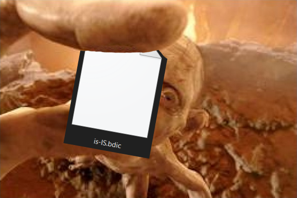

# icelandic_spellcheck_markdown_quest
A search for the best spell checking tools for the Icelandic language

Frequently using markdown to document and plan things. Having a good spell checker is essential since I have no problem making spelling errors.
Of all the editors out there, marktext has become a favorite. It comes with a nice English spell check but is lacking the Icelandic language.
For way too long have I just copied the text in and out of google drive to do the spell check so I want to find another way.

## Research
I found out that the markdown editor that I was using Ghostwriter and Typora were using .aff and .dic for their spell checking. Below is a table of the .aff and .dic files I found online.

| name                                                   | note                                                        |
| ------------------------------------------------------ | ----------------------------------------------------------- |
| Libre office                                           | worked fine for ghostwrited but not when converted to .bdic |
| [hunspell-is](https://github.com/nifgraup/hunspell-is) | Couldn't figure out how to use it                           |
|                                                    | Used to make the .bdic                                      |

### formats and terms
- [Hunspell](https://en.wikipedia.org/wiki/Hunspell) : Spell checker
- [Ispell](https://en.wikipedia.org/wiki/Ispell) : spell checker
- .aff file: grammar rule files
- .dic file: dictinary file with a wordlist
- .bdic file: binary dictinary file that also inclueds grammar rules

## The build
After being unsuccessful in finding a .bdic file for Marktext I found a generator that makes one from .aff, .dic and .dic_delta. I couldn't find or understand the .dic_delta and it generated the file even if it was missing. I had to do it using linux and it was well documented and I didn't have any troubles.

[convert-dict-tool-from-chromium](https://github.com/jankelemen/convert-dict-tool-from-chromium)

To add it to marktext simply add it to the dictionary folder and change the spell settings to use hunspell.
C:\Users\%user%\AppData\Roaming\marktext\dictionaries

## Conclusion
It works well now It's missing some words but I can add them over time and Marktext generates a .json file so it's easy to keep track of it and I might update it here from time to time. 

